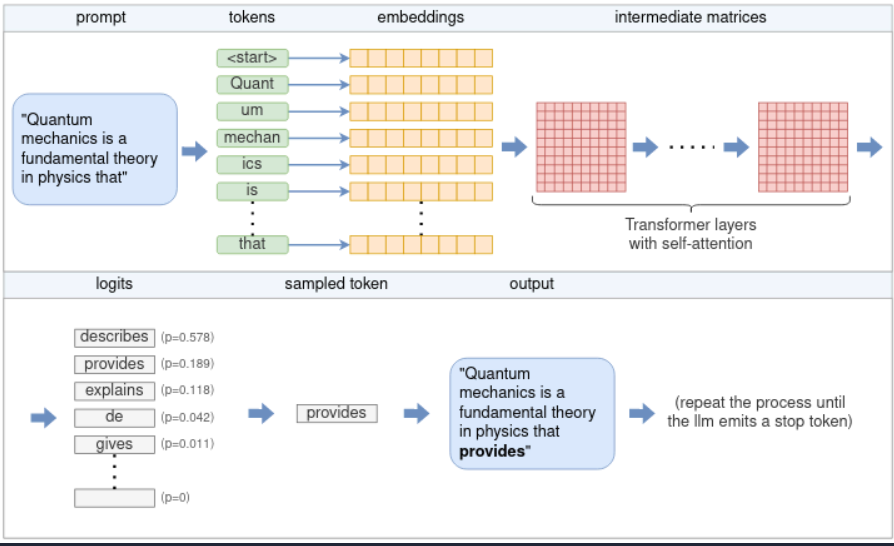

#+TITLE: LLama.cpp 是如何推理的
#+DATE: <2025-10-06 一>
#+AUTHOR: yangsiyu

引用：[[https://www.omrimallis.com/posts/understanding-how-llm-inference-works-with-llama-cpp/#optimizing-inference][llama.cpp 是如何推理的]]

* 主题
** Tensors
** Tokenization
** Embedding
** Transformer
** Sampling
** KV cache

* High-level flow from prompt to output

按照图表，流程如下：
  1. 
